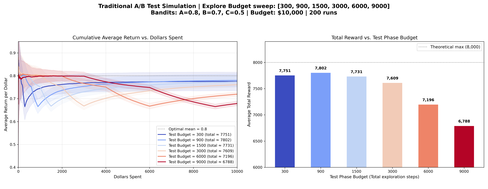

# 多臂賭博機問題：傳統 A/B 測試 (A/B Testing) 介紹

## 演算法核心概念

在傳統商業策略與網頁設計中，**A/B 測試 (A/B Testing)** 是最廣為人知的實驗方法。其實作邏輯非常直觀，主要分為兩個階段：

1. **測試期 (Test Phase / Pure Exploration)**
   事先劃分一筆固定的預算或流量（Test Budget），將其「完全平均」地投入到所有候選方案（機台）上收集數據。
   
2. **應用期 (Exploitation Phase / Pure Exploitation)**
   測試期結束後進行結算，直接選出這段期間內「平均回報最高」的方案，並將剩下的所有預算與流量全部投入該獲勝方案中，不再花費任何資源進行測試。

---

## 模擬結果與圖表解析

以下是針對三個期望回報分別為 `A=0.8, B=0.7, C=0.5` 的機台，在總步數為 10,000 步的情境下，針對不同「測試期預算」進行掃描的模擬結果（平均 200 次獨立實驗）：

### 圖表洞察 (Insights)

1. **過早下定論的風險 (Test Budget 過低)**
   觀察右圖的長條圖，當預算 `Test Budget = 300` 時（即每台機器只分配 100 次），平均總回報最低。這是因為在雜訊（標準差=1.0）的干擾下，100 次的樣本數極度容易發生**誤判**，一旦在測試期後誤選了較差的機台 B 或 C，應用期就會持續產出低回報（Regret 飆高）。

2. **過度測試的浪費 (Test Budget 過高)**
   當預算高達 `Test Budget = 9000` 時，雖然幾乎能 100% 確保最後選出最佳的機台 A，但右圖總回報卻同樣不增反減。從左圖深紅色的線條可以看出，因為我們花費了高達 9000 步「平均測試」所有機台（包含表現最差的 C），導致整體的累積平均回報被嚴重拖垮。

3. **A/B 測試的兩難 (Exploration-Exploitation Dilemma)**
   A/B 測試最大的痛點在於「**需要人為給定測試長度**」。如果測試期太短，容易選錯；如果測試期太長，又會浪費太多流量在差勁的方案上。這正是後續動態調整演算法（如 Epsilon-Greedy、UCB 等）要試圖解決的核心痛點。
