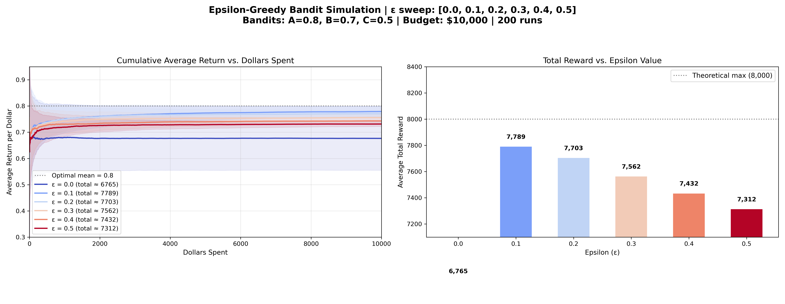

# 多臂賭博機問題：Epsilon-Greedy (ε-貪婪演算法) 介紹

## 演算法核心概念

為了解決傳統 A/B 測試將「探索」與「利用」兩個階段完全硬性切開，並且需要人為猜測完美測試期的缺點，**Epsilon-Greedy ($\epsilon$-Greedy)** 提出了一種將探索與利用完美交織的策略。

在序列決策的每一步（每一次選擇）中，我們都有：
- **$\epsilon$ 的機率進行「探索」 (Exploration)**：
  無視過往數據累積的結果，完全隨機挑選一台機器，確保我們有機會持續測試那些可能被低估的方案。
- **$1 - \epsilon$ 的機率進行「利用」 (Exploitation)**：
  根據目前所有收集到的數據，貪婪地選擇「目前平均回報最高」的機器。

---

## 模擬結果與圖表解析

以下是針對三個期望回報分別為 `A=0.8, B=0.7, C=0.5` 的機台，在總步數為 10,000 步的情境下，針對不同的 $\epsilon$ 值進行掃描的模擬結果（平均 200 次獨立實驗）：

### 圖表洞察 (Insights)

1. **純貪婪的陷阱 ($\epsilon = 0.0$)**
   當 $\epsilon = 0.0$ 時（深藍色線），演算法不會進行任何探索。雖然在左圖中它早期的上升速度極快，但在右圖中的總回報卻僅排在中段班。原因是如果它一開始不巧在機台 A 拉出負分，它就會徹底放棄 A 而卡在次佳的機台 B 上，導致陷入局部最佳解（Suboptimal Convergence）。

2. **最佳探索比例 ($\epsilon = 0.1$)**
   當 $\epsilon = 0.1$ 時（淺藍色線），取得了最好的綜合表現。這 10% 的隨機性提供了足夠的容錯率，讓演算法在錯失最佳機台時有機會被重新校正回來，同時又保有整體高達 90% 的利用率來最大化總體收益。

3. **過度探索的浪費 (高 $\epsilon$)**
   隨著 $\epsilon$ 持續拉高（例如 $\epsilon = 0.5$ 深紅色線），代表有一半的時間都在「隨機盲猜」。雖然這能最快幫助所有機台的信心區間收斂，但不可避免地將次數過度浪費在極差機台（如機台 C）上，導致左圖的累積平均回報被往下拉，進而使右圖的總回報表現墊底。

4. **與 A/B 測試的差異**
   Epsilon-Greedy **不需要預先知道總時長**，就能在一邊運行的過程中一邊逐漸優化收益。圖表中平滑漸進升高的學習曲線，也展現了這種演算法在缺乏先驗知識時，依然強大且優雅的動態學習能力。
