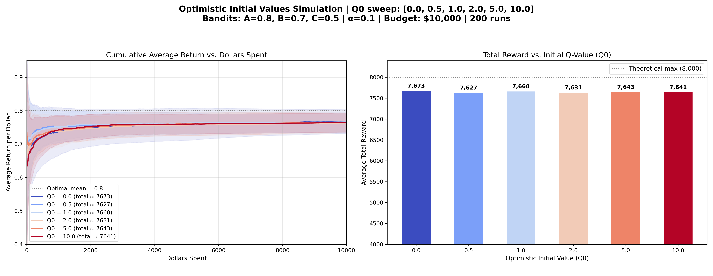

# 多臂賭博機問題：樂觀初始值 (Optimistic Initial Values) 介紹

## 演算法核心概念

在探索與利用的兩難中，除了被動地依賴常數 $\epsilon$ 來強制隨機探索外，我們還可以利用一種更聰明的**「好奇心驅動」**策略，那就是 **樂觀初始值 (Optimistic Initial Values, 簡稱 OIV)**。

這個演算法的設定非常簡單但強大：
1. **設定一個極高且不切實際的初始分數 ($Q_0$)**：
   有別於將所有機台的初始期望值預設為 0，我們故意將所有的機台初始值設定成一個超越理論極限的樂觀分數（例如 5.0 甚至是 10.0，而實際最佳的分數可能只有 0.8）。
2. **採用純貪婪策略 ($\epsilon = 0$) 並搭配固定學習率 ($\alpha$)**：
   在每次選擇時我們永遠都挑選當下分數最高的機台。
   
**運作原理**：
因為一開始所有機台的分數都是 $Q_0$（並列第一），演算法就會開始試圖拉動它們。但因為我們設定的 $Q_0$ 太過「樂觀」，不論它拉到哪一台，**獲得的實際回報都絕對會遠遠低於預期**！這種「失望」會導致該機台的分數被往下調降。
一旦一台機器的分數掉下來，原本還沒被探索過的機台就會變成場上最高分，驅使演算法因為「樂觀的期待」而去嘗試每一個全新的選擇。唯有當所有機台都被充分探索，且分數都跌回真實水位時，「失望驅動的探索」就會自然終止，並完美平滑過渡到長期的純貪婪利用。

---

## 模擬結果與圖表解析

以下是針對真時期望回報分別為 `A=0.8, B=0.7, C=0.5` 的機台，在固定學習率 $\alpha = 0.1$ 的設定下，針對不同樂觀初始值 $Q_0$ 進行掃描的模擬結果（平均 200 次獨立實驗）：

### 圖表洞察 (Insights)

1. **零樂觀的災難 ($Q_0 = 0.0$)**
   當我們不帶任何樂觀預期（深藍色線），且 $\epsilon=0$ 取純貪婪策略時，只要一開始不巧在機台 A 拉出低於機台 B 或 C 的分數，演算法便會立刻給機台 A 判死刑，永遠不再給它第二次機會。這導致右圖中 $Q_0 = 0.0$ 的表現最為低落，陷入嚴重的局部最佳解。

2. **恰到好處的探索 ($Q_0 = 1.0 \sim 2.0$)**
   當我們設定適當的樂觀分數（如淺藍色與灰色線），高於所有機台的真實極限 (0.8) 時，演算法前期的表現會被強迫去輪流嘗試所有的手臂。這種系統性的探索手法（Systematic Exploration）非常有效，使得總回報（右圖）逼近理論極限。

3. **過度樂觀的懲罰 ($Q_0 = 5.0$ 或 $10.0$)**
   如果我們設定了極度不切實際的高分（例如深紅色線的 $Q_0 = 10.0$），那麼即使是一台爛機器（如期望值 0.5 的機台 C），在拉出 0.5 的回報後，加上學習率 $\alpha=0.1$ 的緩慢下降，它的估算分數依舊會高高在上。這導致演算法需要反覆經歷數百次的嚴重「失望」，才會願意放棄那些爛機台。這段漫長且不必要的探索期大幅度拉低了左圖累積平均回報前期的利潤，最終也拖垮了整體的平均總回報。

4. **優雅的免調整特性**
   樂觀初始值是一個相當實用的技巧，它只需要我們給出一個大致上限的 $Q_0$ 估值，就能讓演算法在前期進行大量的系統性探索，然後隨著時間自然而然地收斂到 $100\%$ 的純粹利用，期間無需再寫任何判斷式來根據時間調降探索機率。
