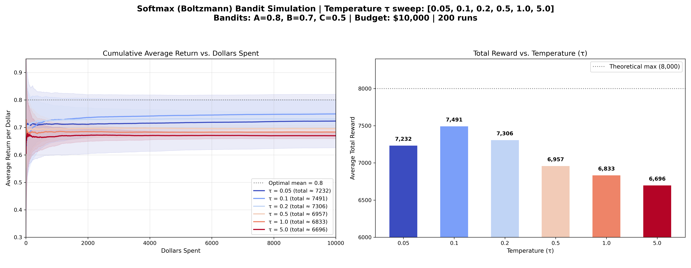

# 多臂賭博機問題：Softmax (Boltzmann) 演算法介紹

## 演算法核心概念

雖然 Epsilon-Greedy ($\epsilon$-Greedy) 是一種有效且簡單的策略，但它在「探索」時有一個明顯的缺點：**它會以完全相等的機率隨機選擇所有非貪婪的機台**。這意味著它會把寶貴的探索機會，平均分配給「可能僅次於最佳解的次佳機台」以及「已經確定非常糟糕的墊底機台」。

**Softmax (或稱 Boltzmann) 演算法** 旨在解決這個問題，讓探索變得「更聰明」。它根據每個機台目前的估計價值（Q 值）來分配選擇機率：價值越高的機台，被選中的機率越大；價值越低的機台，被選中的機率呈指數級遞減。

其選擇機率公式為：
$$ P(A) = \frac{e^{Q(A) / \tau}}{\sum_{i} e^{Q(i) / \tau}} $$

其中，**$\tau$ (Temperature，溫度)** 是控制探索程度的超參數：

- **高溫 (高 $\tau$)**：所有機率趨於均等，演算法傾向於**純粹隨機探索**。
- **低溫 (低 $\tau$)**：放大分數之間的差異，演算法傾向於**絕對貪婪利用**。

---

## 模擬結果與圖表解析

以下是針對三個期望回報分別為 `A=0.8, B=0.7, C=0.5` 的機台，在總步數為 10,000 步的情境下，針對不同的 $\tau$ 值進行掃描的模擬結果（平均 200 次獨立實驗）：

### 圖表洞察 (Insights)

1. **隨機探索的退化 (高 $\tau = 5.0$)**
   當 $\tau = 5.0$ 時（深紅色線），各機台的 Q 值差異被極大地縮小，演算法幾乎退化為純隨機選擇（選擇各機台的機率趨近於 33%）。這種情況下，演算法花費極多時間在回報只有 0.5 的機台 C 上，導致累積平均回報低迷，右圖的總回報也幾乎墊底。

2. **最佳溫度與平穩收斂 ($\tau = 0.1$ ~ $\tau = 0.2$)**
   當 $\tau$ 介於 0.1 到 0.2 之間時（淺藍色線），演算法表現出最佳的平衡。它能迅速將劣質的機台 C 排除在選擇之外，並將絕大多數的選擇集中在最優的機台 A 上，偶爾試探次佳的機台 B。這使其在右圖能取得逼近 8000 的極佳總回報。

3. **過度貪婪的局部最佳解 (極低 $\tau = 0.05$)**
   當 $\tau = 0.05$ 時（深藍色線），只要某個機台在最早期獲得了一兩次好成績，其微小的 Q 值優勢就會被指數函數無限放大，導致演算法幾乎立刻變成 100% 貪婪。這就像 $\epsilon$-Greedy 中 $\epsilon=0$ 的情況一樣，極易陷入局部最佳解（次佳機台 B）。

4. **相較於 Epsilon-Greedy 的優勢**
   從左圖可以看出，良好調整過 $\tau$ 參數的 Softmax 演算法，其累積平均回報曲線後期幾乎是平緩的水平線（沒有被下拉的跡象）。這是因為它會穩步將墊底機台的探索機率降至 **幾乎為 0**，而不像 Epsilon-Greedy 會永遠保留固定的隨機盲猜比例。這賦予了 Softmax 更平滑的學習曲線與更高的長期漸進收益。
