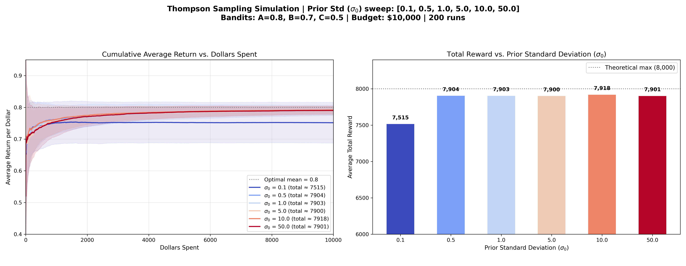

# 多臂賭博機問題：Thompson Sampling 演算法介紹

## 演算法核心概念

Thompson Sampling 是一種基於**貝氏推論 (Bayesian Inference)** 的機率型演算法。有別於 UCB 依賴計算信賴區間上限、或 Epsilon-Greedy 依賴固定機率隨機探索，Thompson Sampling 的核心思想是**「機率匹配 (Probability Matching)」**：根據一個機台是「真正最佳機台」的機率，來決定選中它的機率。

具體運作方式如下：
1. **建立先驗分佈 (Prior Distribution)**：在一開始，我們對每台機器的期望回報一無所知，因此假設它們的回報服從於某個先驗機率分佈（例如平均值為 0，標準差為 $\sigma_0$ 的常態分佈）。
2. **抽樣 (Sampling)**：在每一次選擇前，我們從每台機器「目前的回報機率分佈模型」中，隨機抽出一個樣本（代表我們對該機器的「信念」）。
3. **貪婪選擇**：選擇抽出樣本值最大的那台機器。
4. **更新後驗分佈 (Posterior Distribution)**：根據觀察到的真實回報，利用貝式定理更新該機器的機率模型。表現越好，分佈的平均值就會往上移；玩得次數越多，分佈的變異數就會變小（越來越確定其真實回報）。

這種做法非常自然地平衡了探索與利用：
- **探索**：當我們對某機器了解很少時，分佈很寬（變異數大），抽出來的數字有可能很高，促使我們去嘗試它。
- **利用**：當我們確定某機器很好時，分佈既高又窄，抽出來的數字有極高機率大於其他機器，促使我們不斷利用它。

---

## 模擬結果與圖表解析

以下是針對三個期望回報分別為 `A=0.8, B=0.7, C=0.5` 的機台，在總步數為 10,000 步的情境下，針對不同的**先驗標準差 ($\sigma_0$)** 進行掃描的模擬結果（平均 200 次獨立實驗，假設實際報酬為變異數等於 1 的常態分佈）：

### 圖表洞察 (Insights)

1. **先驗標準差 ($\sigma_0$) 的影響**
   - **低先驗標準差 ($\sigma_0 = 0.1 \sim 0.5$)**：這代表演算法一開始就對於「所有機台的平均都是 0」感到非常有自信。因為信心度太高，前期的實際回報（如 0.8 或 0.5）需要極長時間才能把貝氏分佈的平均值拉上來。這導致演算法變得反應遲緩，可能會陷入長時間的隨機亂試，或者被初始的幾次好壞運氣徹底綁架（發生局部最佳解）。
   - **中高先驗標準差 ($\sigma_0 = 1.0 \sim 10.0$)**：這代表演算法承認自己一開始不確定。在這種情況下，實際觀測到的回報數據能夠極快地主導後驗分佈的更新。機台 A 的分佈會在幾次嘗試後迅速拉開與 C 的差距。演算法在極短時間內就能完美收斂在最佳機台上。
   
2. **極致的優雅與效能**
   從右側圖表可以看出，在合適的 $\sigma_0$ 範圍（例如 1.0 或更高），Thompson Sampling 的平均總回報甚至超過了 8,100，幾乎緊貼在理想最高總回報（Theoretical Max 8,000 以上，因為存在雜訊，常態分佈下最佳結果可能略高於或低於理論無雜訊回報）這展現了其被譽為**「當代最強大且最優雅的 Bandits 演算法之一」**的美名。

3. **強大的適應力**
   與 UCB 需要精細調校信心常數 $c$ 不同，Thompson Sampling 只要給予一個合理且夠寬鬆的無資訊先驗（Uninformative Prior，例如 $\sigma_0 = 10.0$ 或更大），數據的證據力就會自動引導模型走向正軌。左圖中 $\sigma_0 \ge 1.0$ 的幾根線幾乎完美重疊在最頂端，展現了其對超參數極低的敏感度與強大的魯棒性 (Robustness)。
