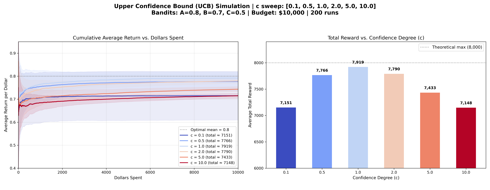

# 多臂賭博機問題：Upper Confidence Bound (UCB) 演算法介紹

## 演算法核心概念

在過去的 Epsilon-Greedy 與 Softmax 演算法中，探索機制多少都帶有「隨機性」。但人類在面臨選擇時，往往會基於「好奇心」去探索那些**不確定性極高**的事物。這正是 **Upper Confidence Bound (UCB)** 演算法的出發點：樂觀地面對未知（Optimism in the Face of Uncertainty）。

UCB 演算法不再依賴純隨機來探索，而是為每一台機器計算一個**信賴區間上限 (Upper Confidence Bound)**，並總是選擇上限最高的那台機器。公式如下：

$$ A_t = \arg\max_a \left[ Q(a) + c \sqrt{\frac{\ln(t)}{N(a)}} \right] $$

- **$Q(a)$ (利用)**：目前的歷史平均回報。
- **$\sqrt{\frac{\ln(t)}{N(a)}}$ (探索)**：這是不確定性衡量項。隨著總步數 $t$ 增加（分子變大），如果不去拉某台機器，它的不確定性就會慢慢變大；但只要拉了它（分母 $N(a)$ 變大），不確定性就會迅速縮小。
- **$c$ (Confidence Degree，探索常數)**：用來調節兩者比重的超參數。$c$ 越大，演算法越重視探索；$c$ 越小，演算法越偏向貪婪利用。

---

## 模擬結果與圖表解析

以下是針對三個期望回報分別為 `A=0.8, B=0.7, C=0.5` 的機台，在總步數為 10,000 步的情境下，針對不同的 $c$ 值進行掃描的模擬結果（平均 200 次獨立實驗）：

### 圖表洞察 (Insights)

1. **系統性的探索取代隨機盲猜**
   UCB 最大的優勢在於它不會像 Epsilon-Greedy 一樣盲目地浪費次數在已經確定是劣質的機台上（例如機台 C）。一旦 $N(C)$ 達到足以證明它很差的程度，即使時間 $t$ 繼續增加，其微幅成長的探索項也無法彌補與最佳機台 A 之間巨大的 $Q(a)$ 差距，因此 UCB 會果斷放棄它。

2. **探索常數的影響 ($c$ 值的選擇)**
   - **過度貪婪 ($c = 0.1$)**：探索動力極弱，如果一開始最佳機台手氣不好，演算法很容易落入並卡在次佳機台（局部最佳解），導致左圖早期的陡峭上升後繼無力。
   - **最佳平衡 ($c = 1.0 \sim 2.0$)**：能確保所有的可能性都被充分探索，同時在認定勝負後，快速收斂到最佳機台上，取得了這幾組測試中的最高總收益。
   - **過度探索 ($c = 5.0, 10.0$)**：由於強制要求將所有機台的不確定性降到極光，演算法花費了過多力氣在輪流測試所有的可能，導致前中期的獲利累積緩慢（左圖從低處慢慢爬升）。

3. **收斂與穩定性**
   從左圖可以看出，UCB 在達到特定臨界點後，能把資源近乎 100% 地投入在最佳解上（線條變平），而不會像 Epsilon-Greedy 產生長期的收益漏斗。這使得 UCB 成為了理論最為扎實、實踐效果極佳的強大策略。
